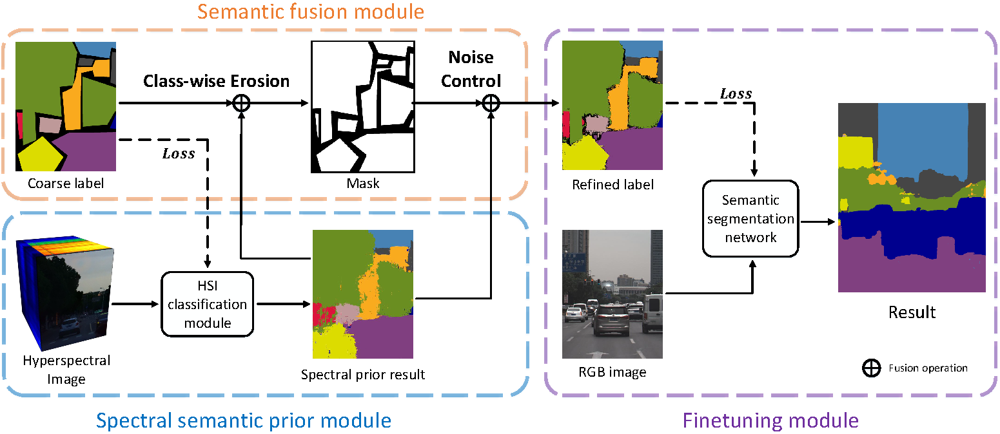

# {Weakly-supervised Semantic Segmentation in Cityscape via Hyperspectral Image

## Introduction
This is the code of hyperspectral semantic prior module in paper [hyperspectral image semantic segmentation in cityscapes]. We introduce a semi-supervised HSI semantic segmentation network, which utilizes spectral information to improve the coarse labels to a finer degree. The framework is shown in the figure below.


## Quick start
### Install
1. Install PyTorch=1.2.0 following the [official instructions](https://pytorch.org/)
2. git clone https://github.com/NJU-hyx/Hyperspectral-Image-Semantic-Segmentation-in-Cityscapes

### Data preparation
You need to download the [Hyperspectral City V1.0](https://pbdl2019.github.io/) datasets.

Your directory tree should be look like this:
````bash
$SEG_ROOT/data
├── hsicity
│   ├── test
│   ├── train
│   └── val
├── list
│   ├── hsicity
│   │   ├── test.lst
│   │   ├── trainval.lst
│   │   └── val.lst
````
